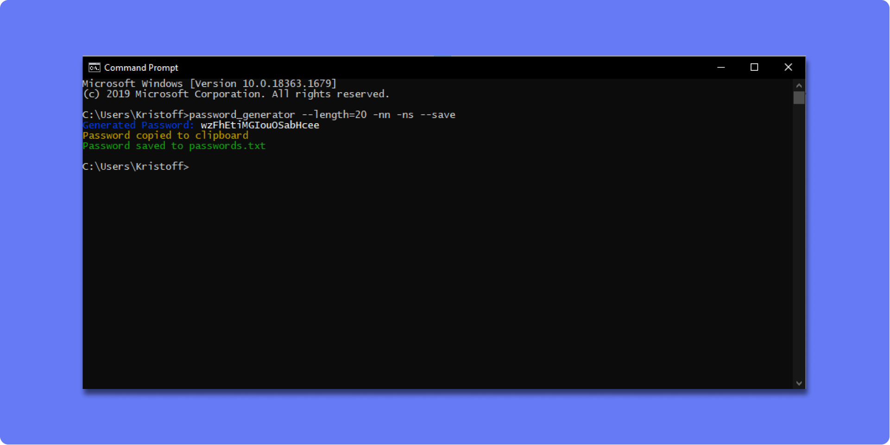

# NodeJs Password Generator

Password Generator is a commandline app that generates passwords Node.js along with Commander and Chalk.

The passwords generated are alpha numeric and contains symbols. Different options can be added to alter the length, remove symbols and/or remove numbers.


Options it takes are:

    
    --length = [number] 
    --nn (removes numbers)
    --ns (removes symbols)
    
## Build Steps ⚙️
 
This project was built with NodeJs -v 12.xx. Packages used includes:

    1. chalk ^4.1.1
    2. clipboardy ^2.3.0
    3. commander ^8.0.0
 
Running Locally 🖥️

1.Clone repo using the following command
 ```shell script
git clone https://github.com/Itsyaboikris/NodeJs-password-generator.git
```
2.Install dependencies
 ```shell script
npm install
```
3.Run project 🎉
```shell script
node index
```

